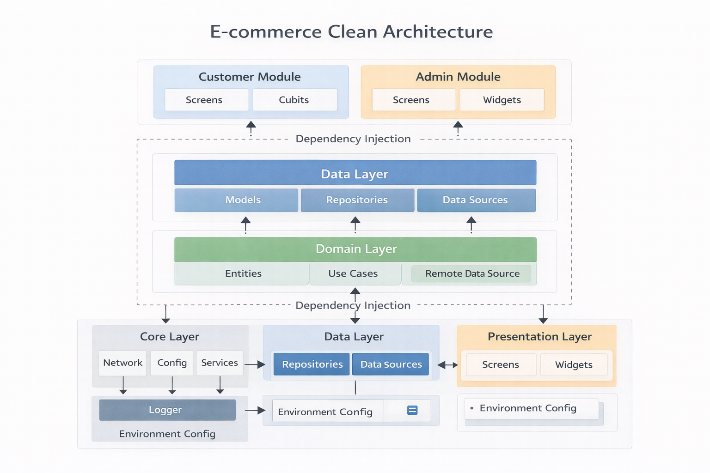
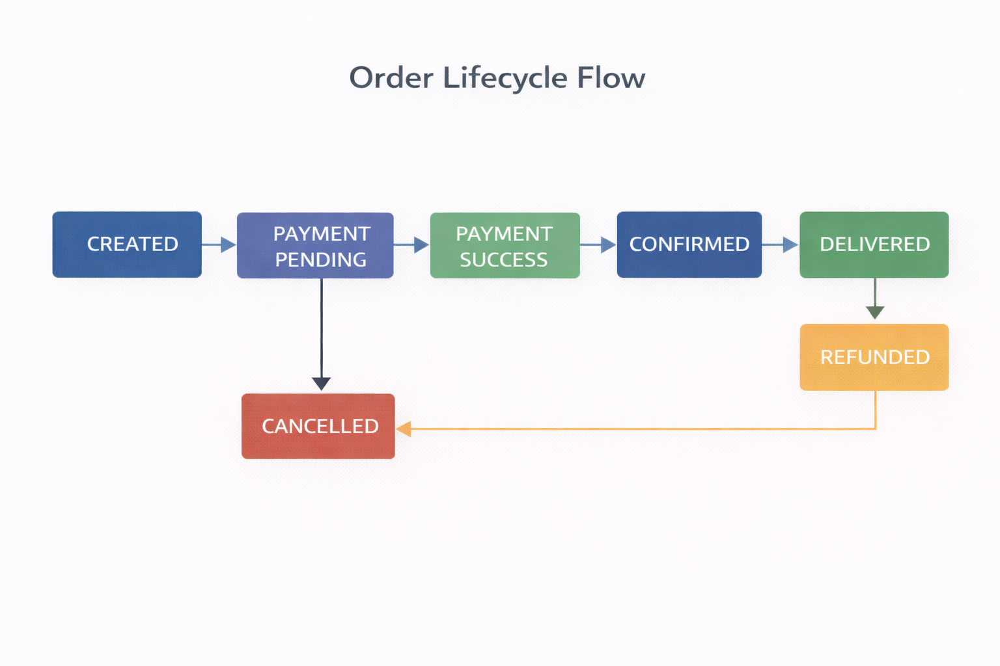
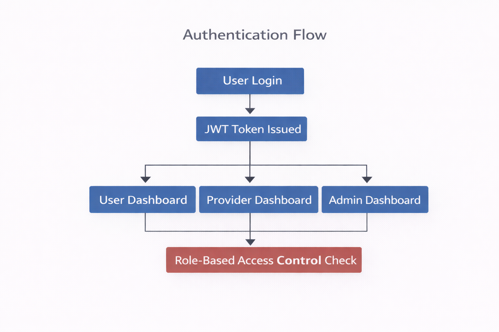
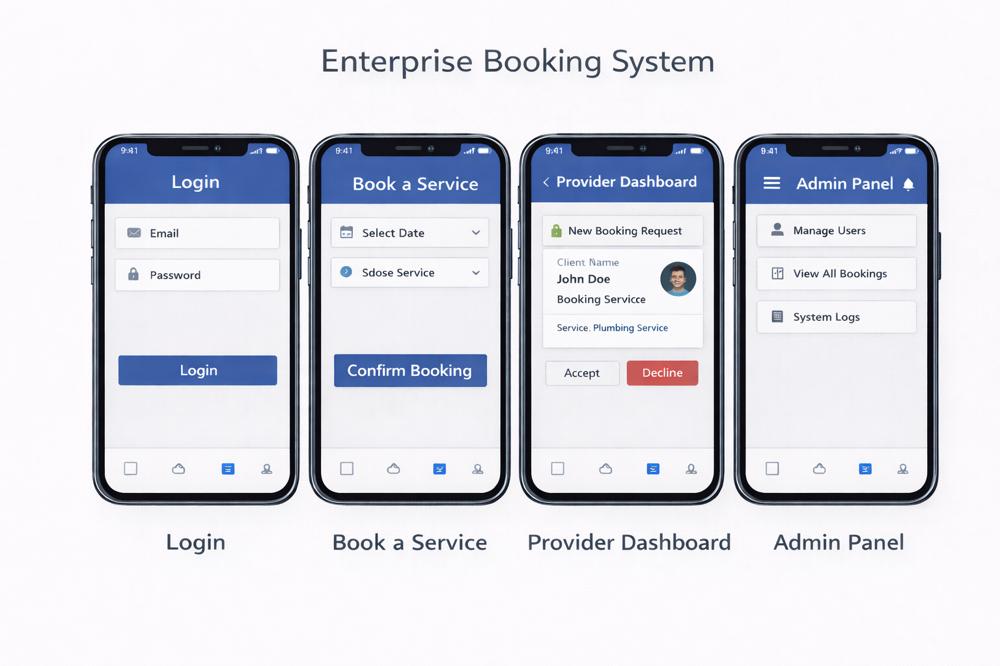

# Enterprise E-commerce System

> Production-ready Flutter E-commerce Architecture for scalable startups. Clean Architecture, JWT auth, cart, wishlist, order lifecycle, and Stripe-ready payment structure.

## Project Overview

The Enterprise E-commerce System is a product-based Flutter architecture designed for startups and product companies that need a scalable, investor-ready foundation. It supports JWT authentication, product and category management, cart and wishlist, full order lifecycle, and a Stripe integration structure—with a clear path to admin modules and microservices.

**Business Problem**: Startups need an e-commerce codebase that can scale with the business, support multiple roles (customer vs admin), integrate payments safely, and maintain clear boundaries so teams can ship features without breaking core flows.

**Solution**: A Clean Architecture-based Flutter application with domain-driven design, dependency injection, repository pattern, and explicit order lifecycle states. The architecture is backend-agnostic and ready for real API integration.

---

## Architecture Diagram



### Architecture Layers

#### **Presentation Layer**
- **Responsibility**: UI, state management, user interactions
- **Components**: Customer screens (product list, cart, wishlist, checkout), Admin screens (product CRUD)
- **Dependencies**: Domain layer only (via use cases)
- **Key Features**:
  - Customer vs Admin separation
  - Placeholder screens ready to wire to use cases
  - No business logic in UI

#### **Domain Layer**
- **Responsibility**: Business logic, entities, use cases, repository contracts
- **Components**: Entities (Product, Cart, Order, OrderStatus, User, AuthResponse), Repository interfaces, Use cases
- **Dependencies**: None (pure Dart)
- **Key Features**:
  - Order lifecycle (CREATED → PAYMENT_PENDING → … → DELIVERED / CANCELLED / REFUNDED)
  - Cart and wishlist rules
  - Result type for explicit success/failure

#### **Data Layer**
- **Responsibility**: API access, models, repository implementations
- **Components**: Models (JSON ↔ Entity), Remote data sources, Repository implementations
- **Dependencies**: Domain layer, Core layer
- **Key Features**:
  - Dio-based API client with JWT interceptors
  - Exception → Failure mapping
  - Stripe payment datasource structure (mock in Phase 1)

#### **Core Layer**
- **Responsibility**: Cross-cutting concerns and infrastructure
- **Components**: Network (ApiClient), Config (EnvironmentConfig), Services (StorageService), Error (Failure, Exception), Logger, Utils (Result)
- **Dependencies**: External packages only
- **Key Features**:
  - JWT token storage abstraction
  - Environment-specific config (dev/staging/production)
  - Centralized error handling and logging

---

## Order Lifecycle Flow



### Order Lifecycle States

| State             | Description                                      |
|-------------------|--------------------------------------------------|
| **CREATED**       | Order record created; not yet paid               |
| **PAYMENT_PENDING** | Awaiting payment confirmation (e.g. Stripe)   |
| **PAYMENT_SUCCESS** | Payment confirmed; order can be fulfilled     |
| **CONFIRMED**     | Merchant confirmed; ready to ship                 |
| **SHIPPED**       | Order shipped                                    |
| **DELIVERED**     | Order delivered                                  |
| **CANCELLED**     | Order cancelled (before or after payment)         |
| **REFUNDED**      | Payment refunded                                 |

### Lifecycle Logic

1. **Place order** → Order created with status `CREATED` or `PAYMENT_PENDING` (depending on payment flow).
2. **Payment** → After successful Stripe confirmation, status moves to `PAYMENT_SUCCESS` (or backend sets `CONFIRMED`).
3. **Fulfillment** → Backend/admin moves: `CONFIRMED` → `SHIPPED` → `DELIVERED`.
4. **Cancellation** → Allowed in appropriate states; backend may trigger refund and set `CANCELLED` or `REFUNDED`.

Domain entity: `OrderStatus` and `Order` in `lib/domain/entities/`. Use cases: `PlaceOrderUseCase`, `GetMyOrdersUseCase`; repositories abstract API details.

---

## Authentication Flow



### JWT Authentication

1. **Login**
   - User submits email/password.
   - Backend returns JWT access token (and optionally refresh token).
   - Tokens stored via `StorageService` (Phase 1: SharedPreferences; can swap to secure storage).
   - `AuthRepository` and `LoginUseCase` encapsulate flow.

2. **Token usage**
   - `ApiClient` attaches `Authorization: Bearer <token>` via interceptor.
   - On 401, structure is in place for refresh-token flow (implement when backend supports it).

3. **Logout**
   - `LogoutUseCase` clears stored tokens and user id via `StorageService`.

4. **Session**
   - `AuthRepository.isLoggedIn()` / `getAccessToken()` used for routing and API client.

---

## Clean Architecture Structure

```
lib/
├── core/                          # Cross-cutting concerns
│   ├── config/
│   │   └── environment_config.dart # Dev / staging / production
│   ├── error/
│   │   ├── exceptions.dart        # Data-layer exceptions
│   │   └── failures.dart          # Domain-layer failures
│   ├── logger/
│   │   └── app_logger.dart        # Logging abstraction
│   ├── network/
│   │   └── api_client.dart        # Dio client + JWT interceptor
│   ├── services/
│   │   └── storage_service.dart   # Token & preferences storage
│   └── utils/
│       └── result.dart            # Result<T> for use cases
│
├── domain/                        # Business logic layer
│   ├── entities/
│   │   ├── product.dart
│   │   ├── category.dart
│   │   ├── cart.dart
│   │   ├── cart_item.dart
│   │   ├── order.dart
│   │   ├── order_status.dart      # Lifecycle states
│   │   ├── user.dart
│   │   └── auth_response.dart
│   ├── repositories/
│   │   ├── auth_repository.dart
│   │   ├── product_repository.dart
│   │   ├── cart_repository.dart
│   │   ├── wishlist_repository.dart
│   │   ├── order_repository.dart
│   │   └── payment_repository.dart
│   └── usecases/
│       ├── auth/
│       │   ├── login_usecase.dart
│       │   └── logout_usecase.dart
│       ├── product/
│       │   ├── get_products_usecase.dart
│       │   └── get_categories_usecase.dart
│       ├── cart/
│       │   ├── get_cart_usecase.dart
│       │   ├── add_to_cart_usecase.dart
│       │   └── remove_from_cart_usecase.dart
│       ├── wishlist/
│       │   ├── get_wishlist_usecase.dart
│       │   └── add_to_wishlist_usecase.dart
│       └── order/
│           ├── place_order_usecase.dart
│           └── get_my_orders_usecase.dart
│
├── data/                          # Data access layer
│   ├── models/
│   │   ├── product_model.dart
│   │   ├── category_model.dart
│   │   ├── cart_model.dart
│   │   ├── cart_item_model.dart
│   │   ├── order_model.dart
│   │   ├── user_model.dart
│   │   └── auth_response_model.dart
│   ├── datasources/
│   │   ├── auth_remote_datasource.dart
│   │   ├── product_remote_datasource.dart
│   │   ├── cart_remote_datasource.dart
│   │   ├── wishlist_remote_datasource.dart
│   │   ├── order_remote_datasource.dart
│   │   └── payment_remote_datasource.dart   # Stripe structure
│   └── repositories/
│       ├── auth_repository_impl.dart
│       ├── product_repository_impl.dart
│       ├── cart_repository_impl.dart
│       ├── wishlist_repository_impl.dart
│       ├── order_repository_impl.dart
│       └── payment_repository_impl.dart
│
├── presentation/
│   ├── customer/
│   │   └── screens/
│   │       ├── product_list_placeholder.dart
│   │       ├── cart_placeholder.dart
│   │       └── wishlist_placeholder.dart
│   └── admin/
│       └── screens/
│           └── admin_products_placeholder.dart
│
├── injection_container.dart       # GetIt DI setup
└── main.dart                      # Entry point
```

---

## Product → Cart → Order Flow (Example)

1. **Product listing**  
   `GetProductsUseCase(categoryId?, page, limit)` → `ProductRepository.getProducts()` → API `/products` → list of `Product` entities.

2. **Category filter**  
   Same use case with `categoryId`; backend returns filtered list. UI uses `GetCategoriesUseCase` for filter chips/dropdown.

3. **Add to cart**  
   `AddToCartUseCase(product, quantity)` → `CartRepository.addToCart()` → API `POST /cart/items` → returns updated `Cart` (items, subtotal). Cart screen uses `GetCartUseCase` and `RemoveFromCartUseCase` / update quantity.

4. **Wishlist**  
   `AddToWishlistUseCase(productId)`, `GetWishlistUseCase()`, remove via repository; wishlist screen binds to these use cases.

5. **Place order**  
   - Optional: `PaymentRepository.createPaymentIntent(amount, currency, orderId)` (Stripe) then confirm.
   - `PlaceOrderUseCase(shippingAddressId, paymentIntentId?)` → `OrderRepository.placeOrder()` → API `POST /orders` → order with status e.g. `CREATED` or `PAYMENT_PENDING`.
   - Backend updates status to `PAYMENT_SUCCESS` / `CONFIRMED` and then `SHIPPED` / `DELIVERED`; app can show status via `GetMyOrdersUseCase` / `GetOrderById`.

All steps go through domain use cases and repositories; UI only calls use cases and maps `Result<T>` to UI state.

---

## Tech Stack

- **Flutter** – Cross-platform UI
- **Dio** – HTTP client, interceptors, error mapping
- **GetIt** – Dependency injection
- **Equatable** – Entity equality
- **SharedPreferences** – Token and simple key-value storage (replace with secure storage for production)
- **Clean Architecture** – Layers, repositories, use cases, Result type

---

## Environment Configuration Strategy

`EnvironmentConfig` supports multiple environments:

### Development (`dev`)
- Mock or dev API base URL
- Verbose logging
- Stripe test keys
- Optional mock data

### Staging (`staging`)
- Staging API base URL
- Logging on
- Stripe test keys
- Real API contract

### Production (`production`)
- Production API and Stripe live keys
- Logging off or to external service
- No mock data

Set before app init: `initInjection(environmentConfig: EnvironmentConfigs.dev)` (or staging/production). Use build flavors or env vars to choose config.

---

## Why Clean Architecture

- **Testability**: Domain and use cases are pure Dart; repositories and data sources are mockable.
- **Scalability**: Add features (e.g. coupons, multi-currency) as new use cases and entities without breaking existing flows.
- **Team scaling**: Clear boundaries (presentation / domain / data / core) allow parallel work and onboarding.
- **Backend flexibility**: Swap REST for GraphQL or add caching by changing data layer only; domain and use cases stay the same.
- **Investor-ready**: Demonstrates system thinking, separation of concerns, and readiness for production hardening.

---

## Revenue Logic & Monetization Model

The architecture supports standard e-commerce monetization:

- **Product catalog**: Products and categories drive discovery; filtering and search (when added) support conversion.
- **Cart and checkout**: Order placement and payment intent flow are structured for Stripe (or other providers); revenue is tracked via order total and status.
- **Order lifecycle**: Clear states support analytics (e.g. conversion from CREATED to PAYMENT_SUCCESS, fulfilment metrics, refunds).
- **Admin foundation**: Admin product CRUD sets the base for merchant tools, pricing, and inventory—all extendable without changing customer-facing domain.

Revenue metrics can be derived from orders (total, by status, by product/category) once analytics are wired in Phase 2/3.

---

## Scalability Strategy

- **Horizontal scaling**: Stateless app; session is JWT + backend. Multiple instances supported.
- **Feature scaling**: New flows = new use cases and optional new entities; repositories extend or new ones added.
- **Data scaling**: Pagination in `getProducts` and `getMyOrders`; add caching (e.g. in repository or datasource) when needed.
- **Team scaling**: Presentation (customer vs admin), domain, and data can be owned by different developers; contracts are repository interfaces and entities.

---

## DevOps & Future Microservices Plan

- **CI/CD**: Add build flavors for dev/staging/prod; run tests and static analysis on commit; deploy to stores or internal distribution.
- **Backend**: Current design assumes a single API; when moving to microservices, keep domain and use cases unchanged. API client can route to different base URLs per feature (e.g. orders service, payments service) via config or gateway.
- **Monitoring**: Logger abstraction can forward to Crashlytics, Sentry, or custom backend; order and payment events can be emitted for analytics and alerts.

---

## Caching & Performance Strategy

- **Phase 1**: No local cache; all data from API. Optional: short-lived in-memory cache in datasource.
- **Phase 2+**: Add repository-level cache (e.g. products/categories) with TTL or offline-first layer (e.g. Hive/SQLite) for cart and wishlist.
- **Performance**: Use pagination and lazy loading for product lists; optimize images via CDN and caching when product images are introduced.

---

## Security Strategy

- **JWT**: Stored via abstraction (`StorageService`); production should use secure storage (e.g. flutter_secure_storage). Token not logged.
- **API**: All requests go through `ApiClient`; certificate pinning can be added in Dio.
- **Payment**: No card data in app; Stripe SDK/client_secret flow; PCI scope stays on Stripe.
- **Input**: Validate in use cases or domain; sanitize before sending to API.

---

## Getting Started

### Prerequisites

- Flutter SDK (3.8.0 or higher)
- Dart SDK (3.8.0 or higher)
- Android Studio / Xcode (for mobile builds)
- IDE: VS Code or Android Studio

### Setup Steps

1. **Clone the repository**
   ```bash
   git clone https://github.com/adityaverma47/flutter-ecommerce-enterprise.git
   cd flutter-ecommerce-enterprise/ecommerce_enterprise
   ```

2. **Install dependencies**
   ```bash
   flutter pub get
   ```

3. **Configure environment**
   - Edit `lib/core/config/environment_config.dart` and set `baseUrl` (and Stripe keys if needed) for your backend.
   - In `main.dart`, `initInjection(environmentConfig: EnvironmentConfigs.dev)` can be switched to staging/production.

4. **Run the application**
   ```bash
   flutter run
   ```

### Backend API Expectations (Phase 1 structure)

Endpoints assumed by the data layer:

- **Auth**: `POST /auth/login`, `POST /auth/refresh`
- **Products**: `GET /products`, `GET /products/:id`, `GET /categories`
- **Cart**: `GET /cart`, `POST /cart/items`, `PUT /cart/items/:productId`, `DELETE /cart/items/:productId`, `DELETE /cart`
- **Wishlist**: `GET /wishlist`, `POST /wishlist` (body: `product_id`), `DELETE /wishlist/:productId`
- **Orders**: `POST /orders`, `GET /orders`, `GET /orders/:id`, `PUT /orders/:id/cancel`
- **Payments**: `POST /payments/create-intent`, `POST /payments/confirm`

Use mock server or stub responses until your backend is ready.

---

## App Preview Screens



*(Add screenshots of product list, cart, wishlist, and checkout/order flow when UI is implemented.)*

---

## Future Roadmap

### Phase 2: Testing & Quality
- [ ] Unit tests for use cases (90%+ coverage)
- [ ] Widget tests for critical customer and admin screens
- [ ] Integration tests for Product → Cart → Order flow
- [ ] CI/CD pipeline (build, test, deploy)

### Phase 3: Performance & Caching
- [ ] Local caching (e.g. Hive/SQLite) for products and categories
- [ ] Offline-first cart and wishlist
- [ ] Image caching and CDN
- [ ] Pagination and lazy loading everywhere

### Phase 4: Payments & Checkout
- [ ] Full Stripe SDK integration (replace mock)
- [ ] Checkout UI and address management
- [ ] Refund and dispute handling

### Phase 5: Admin Module
- [ ] Admin product CRUD (create/update/delete)
- [ ] Order management (status updates, fulfilment)
- [ ] Basic analytics dashboard
- [ ] Role-based access (admin vs customer)

### Phase 6: Scale & Microservices
- [ ] API Gateway / BFF alignment
- [ ] Event-driven updates (e.g. order status)
- [ ] Distributed tracing and monitoring
- [ ] Multi-region / multi-tenant readiness

---

## Founder/CTO Perspective

This repository is built as a **foundation for a product company**, not a tutorial or a one-off demo. Decisions reflect:

- **Clarity over cleverness**: Clear layers, explicit order lifecycle, and named use cases so any developer can reason about the system.
- **Business alignment**: Order states, payment structure, and admin foundation map directly to how e-commerce works and how you’ll report revenue and operations.
- **Scalability from day one**: Repository pattern and DI make it easy to add caching, new backends, or new features without rewriting the core.
- **Investor-ready narrative**: You can walk through architecture, order flow, auth, and roadmap and show that the technical base is built to scale with the business.

Extend this with your own branding, UX, and backend; the architecture is designed to stay stable as you grow.

---

## Contributing

When contributing:

1. Follow Clean Architecture: domain pure, data implements repositories, presentation uses use cases.
2. Add tests for new use cases and critical flows.
3. Update this README for new API contracts or environment options.
4. Keep order lifecycle and payment flow documented.

---

## Usage Notice

This repository is intended for portfolio and architecture demonstration and as a foundation for building a real product. Replace mock or placeholder implementations with your own backend and business logic before production use.

---

## Contact

**Aditya Verma**  
Senior Flutter Developer | Cross-Platform Mobile Engineer  
Helping Startups Build Scalable, Real-Time & High-Performance Apps  

📧 adityaverma15.cs@gmail.com  
🔗 LinkedIn: [https://www.linkedin.com/in/aditya-verma-122318212/]
🌍 Available for Freelance & Remote Projects  

---

**Built with Clean Architecture for scalability, maintainability, and investor-ready technical leadership.**
